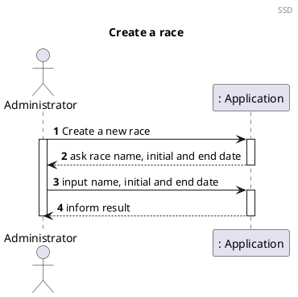
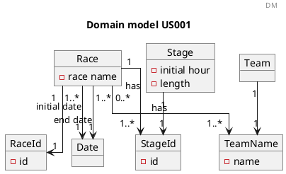
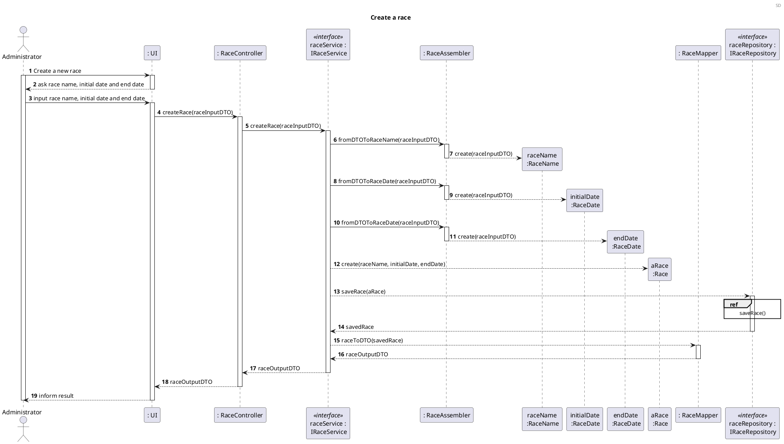
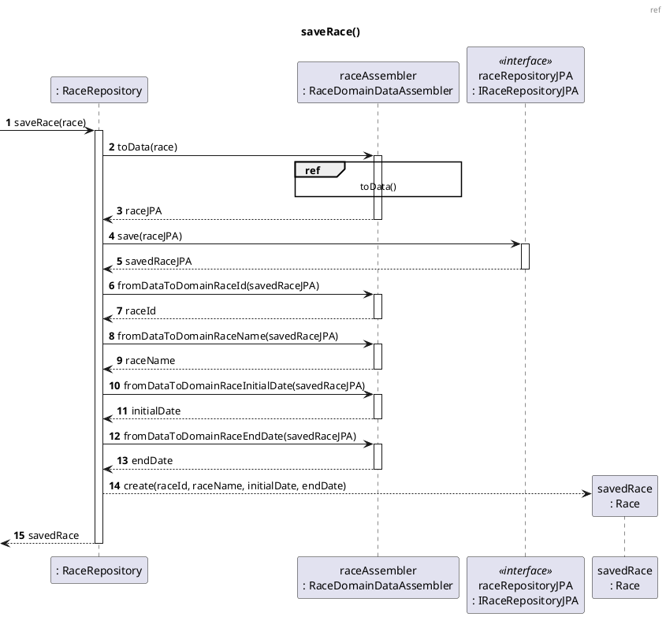
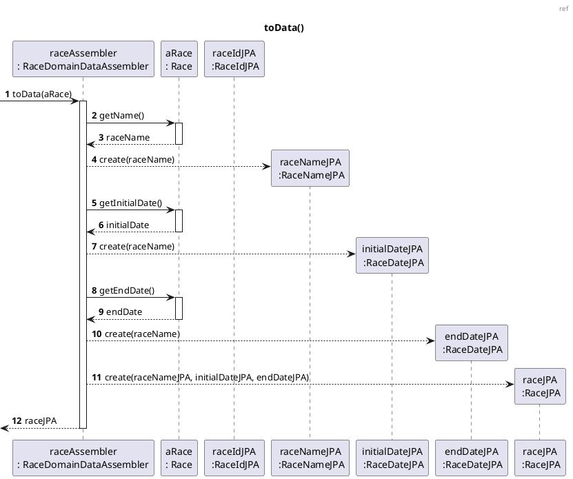

# US001 Create race

# 1. Requirements

_As an administrator, I want to create a race, defining the basic information._

The race has a name and has several stages, these stages have an order.

To create a race we first need to know the name of the race, and the initial and end date of the race must also be
known.

## 1.1. System Sequence Diagram

The System Sequence Diagram below represents the interaction between a System Manager and the Application.



## 1.2. Dependency of other user stories

This US has no dependencies of any other User Stories, nevertheless [US02] needs an existing Race to the Stages to it,
[US06] also needs a race with the respective stages to calculate the length of the Race.

# 2. Analysis

## 2.1 Race entry

According to what was presented in the US, a race is created upon request from the Administrator.

A race should be created with an alphanumeric string as its name, initial and end date. In addition, a Race will have its
own classification.

The identification of the race across the application is obtained by the combination  
of its name and its parent.

With that said, a race should have the following attributes:

| Value Objects          | Business Rules                                                         |
| -------------------    | --------------------------------------------------------------         |
| Name                   | required, alphanumeric, String                                         |
| Race Id                | numeric. The identification of the race                                |
| Initial date           | alphanumeric (String), with format "31/12/2021", required              |
| End date               | alphanumeric (String), with format "31/12/2021", required              |
| Stages                 | a list of the stages in the race                                       |
| Teams                  | a list of all the teams competing in the race                          |

## 2.2 Domain Model Excerpt

For quick reference, there's a relevant extract of the domain model.



# 3. Design

## 3.1. Functionality Development

Regarding the creation of a new race, the requirements specified in [Analysis](#2-analysis) should be accommodated.

The System Diagram is the following:







## 3.2. Class Diagram

The Class Diagram is the following:

## 3.3. Applied Patterns

In order to achieve best practices in software development, to implement this US the following were used:

- *Single Responsibility Principle* - Classes should have one responsibility, which means, only one reason to change;
- *Information Expert* - Assign a responsibility to the class that has the information needed to fulfill it;
- *Pure Fabrication* - CategoryService was implemented to manage all things related to add a Category.
- *Creator* - To create a category we need to check if the category name doesn't exist.
- *Controller* - CreateStandardCategoryController was created;
- *Low Coupling* - Classes were assigned responsibilities so that coupling remains as low as possible, reducing the
  impact of any changes made to the objects later on;
- *High Cohesion* - Classes were assigned responsibilities so that cohesion remains high(they are strongly related and
  highly focused). This helps to keep the objects understandable and manageable, and also goes hand in hand with the low
  coupling principle.

## 3.4. Tests

### 3.4.1 Unit Tests

Referring different aspects of the Race attributes, it is necessary to establish a set of unit tests in relation to the
domain classes, Value Objects and other classes that make up the aggregate. The unit tests are defined below:

- **Unit Test 1:** Assert the creation of a new and valid race.

```java
 @Test
    void createRaceSuccessfully(){
            //arrange


            //act


            //assert

            }
```

- **Unit Test 2:** Do not create a race with invalid name.

```java
@ParameterizedTest
@NullAndEmptySource
    void ensureRaceIsNotCreatedWhenHasInvalidName(String name){
            //arrange

            //act

            //assert
            }
```

- **Unit Test 3:** Do not create a race with an invalid initial date.

```java
@Test
    void ensureRaceIsNotCreatedWhenInitialDateIsInvalid(){
            //arrange

            //act

            //assert
            }
```

- **Unit Test 4:** Do not create a race with an invalid end date.

```java
@Test
    void ensureRaceIsNotCreatedWhenEndDateIsInvalid(){
            //arrange

            //act

            //assert
            }
```

- **Unit Test 5:** Do not create a race already existing.

```java
@Test
    void ensureExistingRaceIsNotCreatedAgain(){
            //arrange

            //act

            //assert

            }
```

### 3.4.2 Integration Tests

In order to ensure that of all parts of the system and functionalities are working correctly (e.g. Controller, Service,
Repository, Domain Model), it is necessary to define a set of Integration Tests that will simulate the system use cases,
such as:

- **Integration Test 1:** Assert the creation of a new and valid Race.

```java
 @Test
    void ensureRootStandardCategoryIsCreated(){
            //arrange
            String name="Shopping";
            ResponseEntity<Object> result;

        CategoryInputDTO categoryInputDTO=new CategoryInputDTO();
        categoryInputDTO.setName(name);

        //act
        result=categoryController.createStandardCategory(categoryInputDTO);

        //assert
        assertNotNull(result);
        assertEquals(HttpStatus.CREATED,result.getStatusCode());
        }
```

- **Integration Test 2:** Do not create a race with invalid name.

```java
@ParameterizedTest
@NullAndEmptySource
    void ensureRaceIsNotCreatedWhenHasInvalidName(String name){
            //arrange

            //act

            //assert
            }
```

- **Integration Test 3:** Do not create a race with an invalid initial date.

```java
@Test
    void ensureRaceIsNotCreatedWhenInitialDateIsInvalid(){
            //arrange

            //act

            //assert
            }
```

- **Integration Test 4:** Do not create a race with an invalid end date.

```java
@Test
    void ensureRaceIsNotCreatedWhenEndDateIsInvalid(){
            //arrange

            //act

            //assert
            }
```
# 4. Implementation

The main challenges that were found while implementing this functionality were:

To minimize these difficulties, a lot of research and study of reliable documentation was done.

So that we could present a reliable functionality, many tests were done, to identify as many possible errors in the
implementation as possible.

# 5. Integration/Demonstration

As mentioned before, this functionality will be directly necessary for [US02], the stages will be added to an existing
race and for [US06], this User Story will calculate the total length of the race and therefore a race must exist within
the application. In addition, this functionality will be indirectly necessary for the remaining User Stories.

At the moment, no other user stories are dependent on this one, so its integration with other functionalities cannot be
tested further.

# 6. Comments

[us02]: US02_Add_Stage.md

[us06]: US06_Total_Race_Length.md

