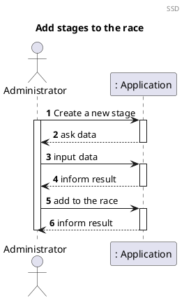
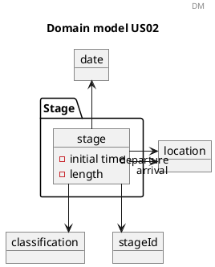
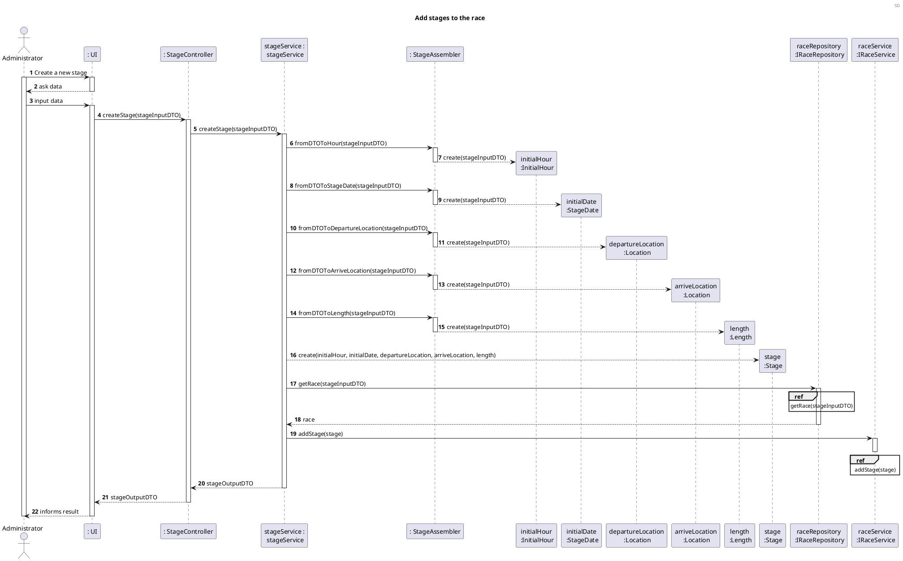

# US02 Add a stage

# 1. Requirements

_Como Administrador, quero adicionar etapas à prova_

To add stages to the race, we first need to create the stage. Each stage has the date, initial time, departure location, arrive location and length. At the end it will have the classification too.

## 1.1. System Sequence Diagram

The System Sequence Diagram below represents the interaction between the Administrator and the
Application.

## 1.2. Dependency of other user stories

This US depends on the US01, because we need to have a race to add the stage for.
The US05, US06, US07 and US08 are dependent on the stage creation.

# 2. Analysis

## 2.1 Stage entry

According to what was presented in the US, the stage is created upon request from the
Administrator, and added to the race.

A stage should be created with an initial date, departure location, arrival location, initial time and length.

It can be more than one stage in the same date. We will have a stage id, so we can add it to the race more easily.

With that said, a stage should have the following attributes:

| Attributes | Rules                                                                  |
| ---------- | --------------------------------------------------------------         |
| initialDate    | required, alphanumeric, date                                         |
| id         | required, numeric. The identification of the stage                            |
| location   | required, string. The name of the departure location                     |
| location | required, string. The name of the departure location |
| initialTime | required, numeric. The hours which the race begin. |
| length | required, numeric. The length of the stage in meters. |

## 2.2 Domain Model Excerpt

For quick reference, there's a relevant extract of the domain model.

# 3. Design

## 3.1. Functionality Development

Regarding adding a stage to the race, the requirements specified
in [Analysis](#2-analysis) should be accommodated.

The System Diagram is the following:

## 3.2. Class Diagram

The Class Diagram is the following:

```puml
<!---
@startuml US001_CD
skinparam guillemet false
skinparam linetype ortho
header CD
title Class Diagram US02


@enduml
-->
```

## 3.3. Applied Patterns

In order to achieve best practices in software development, to implement this US the following were
used:

- *Single Responsibility Principle* - Classes should have one responsibility, which means, only one
  reason to change;
- *Information Expert* - Assign a responsibility to the class that has the information needed to
  fulfill it;
- *Pure Fabrication* - CategoryService was implemented to manage all things related to add a
  Category.
- *Creator* - To create a category we need to check if the category name doesn't exist. 
- *Controller* - CreateStandardCategoryController was created;
- *Low Coupling* - Classes were assigned responsibilities so that coupling remains as low as
  possible, reducing the impact of any changes made to the objects later on;
- *High Cohesion* - Classes were assigned responsibilities so that cohesion remains high(they are
  strongly related and highly focused). This helps to keep the objects understandable and
  manageable, and also goes hand in hand with the low coupling principle.

## 3.4. Tests

### 3.4.1 Unit Tests

# 4. Implementation

# 5. Integration/Demonstration

# 6. Comments

