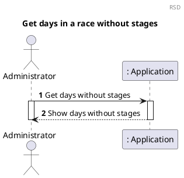
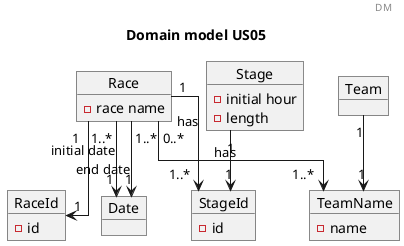
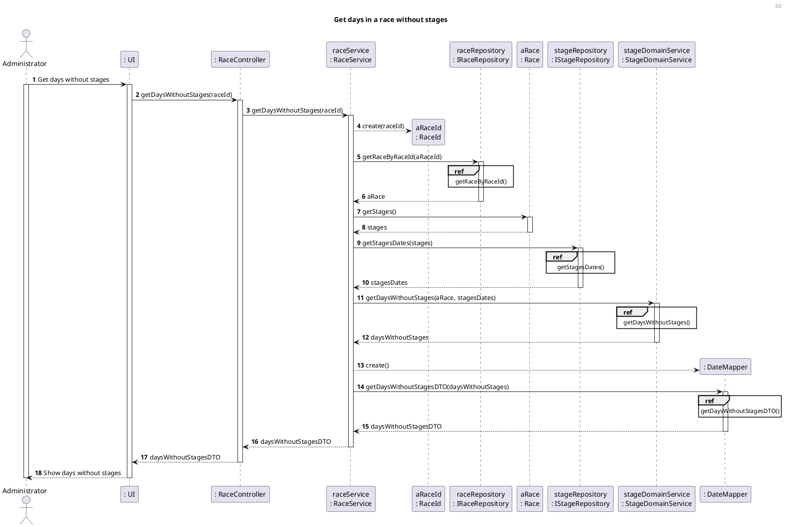
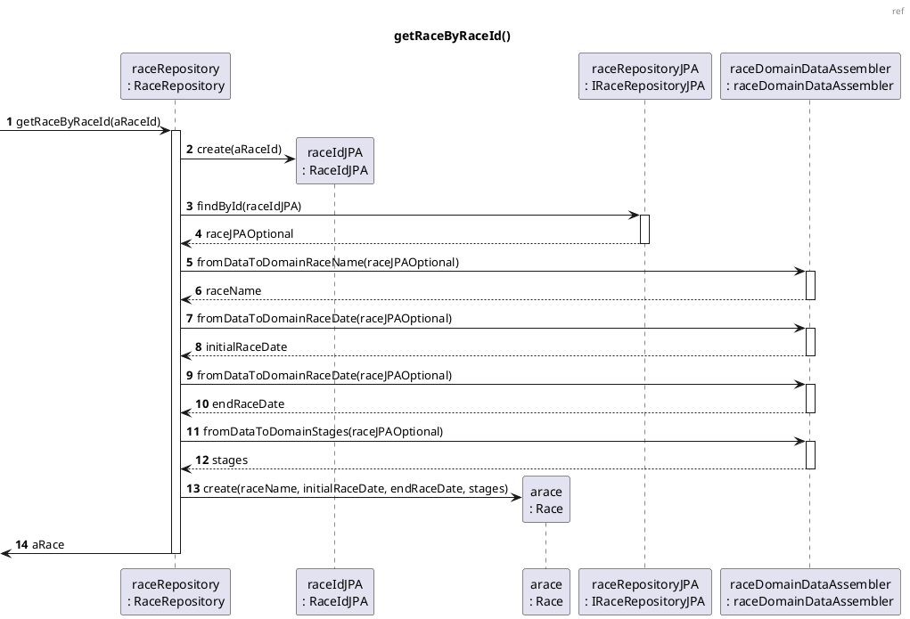
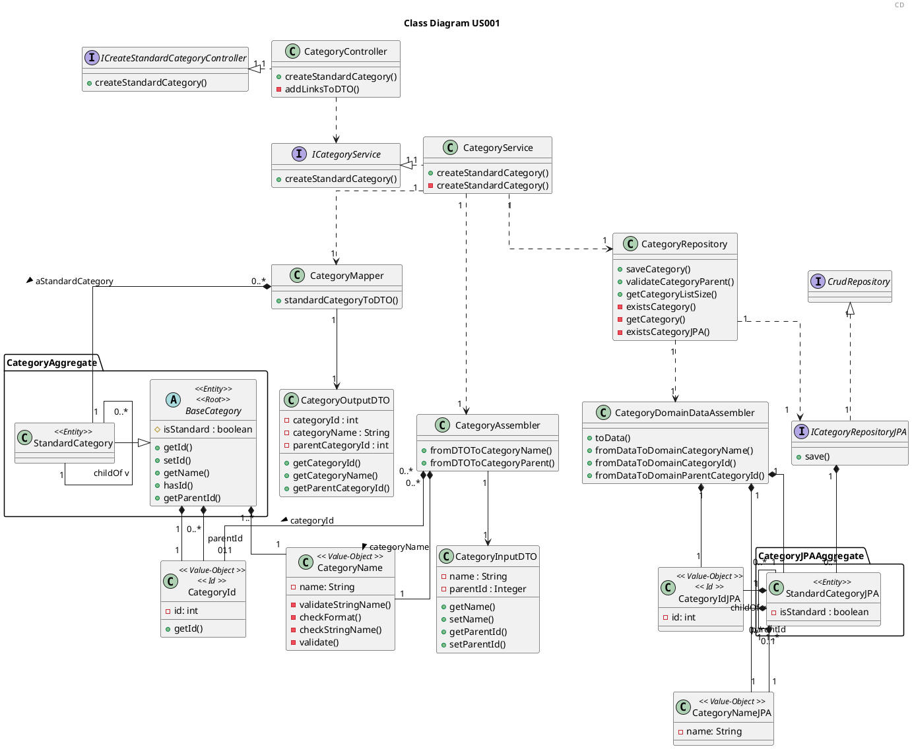

# US05 Get days in a race without stages

# 1. Requirements

_As an administrator, I want to know, which are the days off, i.e, the days when there are no stages._

The race has a name and has several stages, these stages have an order.

To create a race we first need to know the name of the race, and the initial and end date of the race must also be
known.

## 1.1. System Sequence Diagram

The System Sequence Diagram below represents the interaction between an Administrator and the Application.



## 1.2. Dependency of other user stories

This US has dependencies on the [US01] and [US02], since it needs an existing Race and existing Stages within the Race.

# 2. Analysis

## 2.1 Race entry

According to what was presented in the US, a race is created upon request from the Administrator.

A race should be created with an alphanumeric string as its name, initial and end date. In addition a Race will have its
own classification.

The identification of the race across the application is obtained by the combination  
of its name and its parent.

With that said, a race should have the following attributes:

| Value Objects          | Business Rules                                                         |
| -------------------    | --------------------------------------------------------------         |
| Name                   | required, alphanumeric, String                                         |
| Race Id                | numeric. The identification of the race                                |
| Initial date           | alphanumeric (String), with format "31/12/2021", required              |
| End date               | alphanumeric (String), with format "31/12/2021", required              |
| Stages                 | a list of the stages in the race                                       |
| Teams                  | a list of all the teams competing in the race                          |


## 2.2 Domain Model Excerpt

For quick reference, there's a relevant extract of the domain model.



# 3. Design

## 3.1. Functionality Development

Regarding the creation of a new race, the requirements specified in [Analysis](#2-analysis) should be
accommodated.

The System Diagram is the following:







## 3.2. Class Diagram

The Class Diagram is the following:



<!----->

## 3.3. Applied Patterns

In order to achieve best practices in software development, to implement this US the following were used:

- *Single Responsibility Principle* - Classes should have one responsibility, which means, only one reason to change;
- *Information Expert* - Assign a responsibility to the class that has the information needed to fulfill it;
- *Pure Fabrication* - CategoryService was implemented to manage all things related to add a Category.
- *Creator* - To create a category we need to check if the category name doesn't exist.
- *Controller* - CreateStandardCategoryController was created;
- *Low Coupling* - Classes were assigned responsibilities so that coupling remains as low as possible, reducing the
  impact of any changes made to the objects later on;
- *High Cohesion* - Classes were assigned responsibilities so that cohesion remains high(they are strongly related and
  highly focused). This helps to keep the objects understandable and manageable, and also goes hand in hand with the low
  coupling principle.

## 3.4. Tests

### 3.4.1 Unit Tests

Referring different aspects of the Categories attributes, it is necessary to establish a set of unit tests in relation
to the domain classes, namely the **StandardCategory** and the Value Objects that make up the aggregate. The unit tests
are defined below, organized by the corresponding classes:

- **Unit Test 1:** Assert the creation of a new root standard category.

```java
 @Test
    void createRootStandardCategory(){
            //arrange
            String name="Shopping";
            CategoryInputDTO categoryInputDTO=new CategoryInputDTO();
            categoryInputDTO.setName(name);
            CategoryId categoryId=new CategoryId(new Random().nextInt());

            CategoryOutputDTO categoryDTO=new CategoryOutputDTO(categoryId.getId(),name);
            when(categoryService.createStandardCategory(categoryInputDTO)).thenReturn(categoryDTO);

            ResponseEntity<Object> result;
        HttpStatus expected=HttpStatus.CREATED;

        //act
        result=categoryController.createStandardCategory(categoryInputDTO);

        //assert
        assertNotNull(result);
        assertEquals(expected,result.getStatusCode());
        }
```

- **Unit Test 2:** Assert the creation of a new child standard category.

```java
@Test
    void createChildStandardCategory(){
            //arrange
            String name="Shopping";
            CategoryInputDTO categoryInputDTO=new CategoryInputDTO();
            categoryInputDTO.setName(name);
            CategoryId categoryId=new CategoryId(new Random().nextInt());
            CategoryOutputDTO categoryDTO=new CategoryOutputDTO(categoryId.getId(),name);
            when(categoryService.createStandardCategory(categoryInputDTO)).thenReturn(categoryDTO);
            categoryController.createStandardCategory(categoryInputDTO);


            String childName="Clothing";
            CategoryInputDTO categoryChildInputDTO=new CategoryInputDTO();
            categoryChildInputDTO.setName(childName);
            categoryChildInputDTO.setParentId(categoryId.getId());
            CategoryId childId=new CategoryId(new Random().nextInt());
            CategoryOutputDTO categoryChildDTO=new CategoryOutputDTO(childId.getId(),childName,categoryId.getId());
            when(categoryService.createStandardCategory(categoryChildInputDTO)).thenReturn(categoryChildDTO);

            ResponseEntity<Object> result;
        HttpStatus expected=HttpStatus.CREATED;

        //act
        result=categoryController.createStandardCategory(categoryChildInputDTO);

        //assert
        assertNotNull(result);
        assertEquals(expected,result.getStatusCode());
        }
```

- **Unit Test 3:** Throw an error when creating a category with invalid name.

```java
@ParameterizedTest
@NullAndEmptySource
    void ensureRootStandardCategoryNotCreatedWhenInvalidName(String name){
            //arrange
            CategoryInputDTO categoryInputDTO=new CategoryInputDTO();
            categoryInputDTO.setName(name);
            when(categoryService.createStandardCategory(categoryInputDTO)).thenThrow(InvalidNameException.class);

        ResponseEntity<Object> result;
        HttpStatus expected=HttpStatus.BAD_REQUEST;

        //act
        result=categoryController.createStandardCategory(categoryInputDTO);

        //assert
        assertEquals(expected,result.getStatusCode());
        }
```

- **Unit Test 4:** Do not create child category when parent category does not exist.

```java
@Test
    void ensureChildStandardCategoryNotCreatedWithNonExistingParent(){
            //arrange
            String childName="Vegetables";
            int childParentId=new Random().nextInt();
            CategoryInputDTO categoryInputDTO=new CategoryInputDTO();
            categoryInputDTO.setName(childName);
            categoryInputDTO.setParentId(childParentId);
            when(categoryService.createStandardCategory(categoryInputDTO)).thenThrow(ObjectDoesNotExistException.class);

        ResponseEntity<Object> result;
        HttpStatus expected=HttpStatus.BAD_REQUEST;

        //act
        result=categoryController.createStandardCategory(categoryInputDTO);

        //assert
        assertEquals(expected,result.getStatusCode());
        }
```

- **Unit Test 5:** Do not create category already existing.

```java
@Test
    void ensureExistingStandardRootCategoryNotCreatedAgain(){
            //arrange
            String name="Shopping";
            CategoryId categoryId=new CategoryId(new Random().nextInt());
            CategoryInputDTO categoryInputDTO=new CategoryInputDTO();
            categoryInputDTO.setName(name);
            CategoryOutputDTO categoryDTO=new CategoryOutputDTO(categoryId.getId(),name);
            when(categoryService.createStandardCategory(categoryInputDTO)).thenReturn(categoryDTO);
            categoryController.createStandardCategory(categoryInputDTO);

            when(categoryService.createStandardCategory(categoryInputDTO)).thenThrow(DuplicateObjectException.class);

        ResponseEntity<Object> result;
        HttpStatus expected=HttpStatus.BAD_REQUEST;

        //act
        result=categoryController.createStandardCategory(categoryInputDTO);

        //assert
        assertEquals(expected,result.getStatusCode());
        }
```

### 3.4.2 Integration Tests

In order to ensure that of all parts of the system and functionalities are working correctly (e.g. Controller, Service,
Repository, Model), it is necessary to define a set of Integration Tests that will simulate the system use cases, such
as:

- **Integration Test 1:** Assert the creation of a new root standard category.

```java
 @Test
    void ensureRootStandardCategoryIsCreated(){
            //arrange
            String name="Shopping";
            ResponseEntity<Object> result;

        CategoryInputDTO categoryInputDTO=new CategoryInputDTO();
        categoryInputDTO.setName(name);

        //act
        result=categoryController.createStandardCategory(categoryInputDTO);

        //assert
        assertNotNull(result);
        assertEquals(HttpStatus.CREATED,result.getStatusCode());
        }
```

- **Integration Test 2:** Assert the creation of a new child standard category.

```java
@Test
    void ensureChildStandardCategoryIsCreated(){
            //arrange
            String name="Shopping";
            CategoryInputDTO categoryInputDTO=new CategoryInputDTO();
            categoryInputDTO.setName(name);

            CategoryOutputDTO categoryDTO=
            (CategoryOutputDTO)categoryController.createStandardCategory(categoryInputDTO).getBody();
            int parentId=categoryDTO.getCategoryId();

            String childName="Clothing";
            CategoryInputDTO childInputDTO=new CategoryInputDTO();
            childInputDTO.setName(childName);
            childInputDTO.setParentId(parentId);

            ResponseEntity<Object> result;
        HttpStatus expected=HttpStatus.CREATED;

        //act
        result=categoryController.createStandardCategory(childInputDTO);

        //assert
        assertNotNull(result);
        assertEquals(expected,result.getStatusCode());
        }

```

- **Integration Test 3:** Throw an error when creating a category with invalid name.

```java
@ParameterizedTest
@NullAndEmptySource
    void ensureRootStandardCategoryNotCreatedWhenInvalidName(String name){
            //arrange
            CategoryInputDTO categoryInputDTO=new CategoryInputDTO();
            categoryInputDTO.setName(name);

            ResponseEntity<Object> result;
        HttpStatus expected=HttpStatus.BAD_REQUEST;

        //act
        result=categoryController.createStandardCategory(categoryInputDTO);

        //assert
        assertEquals(expected,result.getStatusCode());
        }
```

- **Integration Test 4:** Do not create child category when parent category does not exist.

```java
@Test
    void ensureChildStandardCategoryNotCreatedWithNonExistingParent(){
            //arrange
            String childName="Vegetables";
            int childParentId=new Random().nextInt();
            CategoryInputDTO categoryInputDTO=new CategoryInputDTO();
            categoryInputDTO.setName(childName);
            categoryInputDTO.setParentId(childParentId);

            ResponseEntity<Object> result;
        HttpStatus expected=HttpStatus.BAD_REQUEST;

        //act
        result=categoryController.createStandardCategory(categoryInputDTO);

        //assert
        assertEquals(expected,result.getStatusCode());
        }

```

- **Integration Test 5:** Do not create child category already existing.

```java
@Test
    void ensureExistingStandardChildCategoryNotCreatedAgain(){
            //arrange
            String name="Shopping";
            CategoryInputDTO categoryInputDTO=new CategoryInputDTO();
            categoryInputDTO.setName(name);
            CategoryOutputDTO categoryDTO=
            (CategoryOutputDTO)categoryController.createStandardCategory(categoryInputDTO).getBody();

            int childParentId=categoryDTO.getCategoryId();
            String childName="Clothing";
            CategoryInputDTO childInputDTO=new CategoryInputDTO();
            childInputDTO.setName(childName);
            childInputDTO.setParentId(childParentId);
            categoryController.createStandardCategory(childInputDTO);

            ResponseEntity<Object> result;
        HttpStatus expected=HttpStatus.BAD_REQUEST;

        //act
        result=categoryController.createStandardCategory(childInputDTO);

        //assert
        assertNotNull(result);
        assertEquals(expected,result.getStatusCode());
        }
```

# 4. Implementation

The main challenges that were found while implementing this functionality were:

- The need to identify a parent;

To minimize these difficulties, a lot of research and study of reliable documentation was done.

So that we could present a reliable functionality, many tests were done, to identify as many possible errors in the
implementation as possible.

# 5. Integration/Demonstration

As mentioned before, this functionality will be indirectly necessary for [US002], the standard categories will be shown
in the category tree of the [US002] and for [US110], this User Story will associate the categories with some instance of
Family [US010].

At the moment, no other user stories are dependent on this one, so its integration with other functionalities cannot be
tested further.

# 6. Comments

[us02]: US02_

[us06]: US06_

