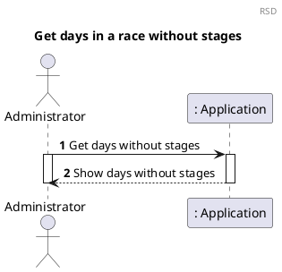
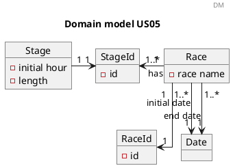
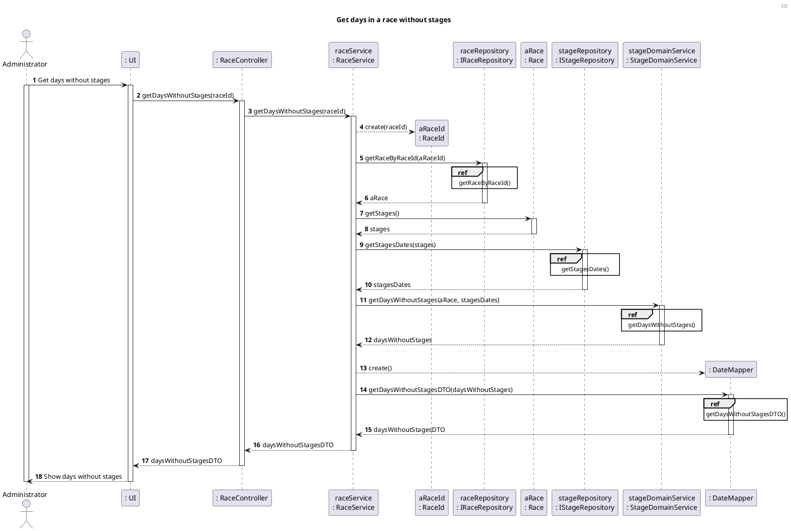
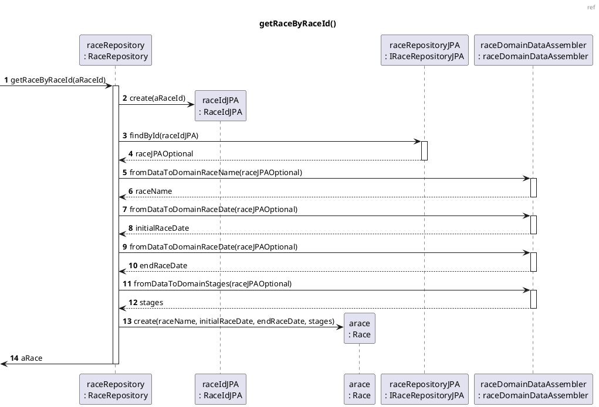
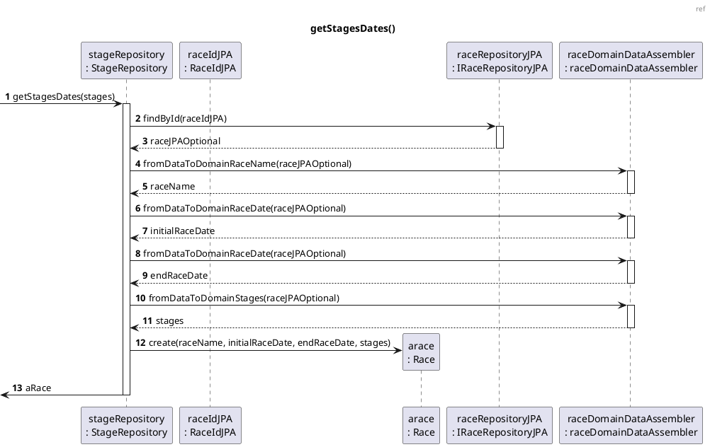

# US05 Get days in a race without stages

# 1. Requirements

_As an administrator, I want to know, which are the days off, i.e, the days when there are no stages._

The race has a name and has several stages, these stages have an order.

To create a race we first need to know the name of the race, and the initial and end date of the race must also be
known.

## 1.1. System Sequence Diagram

The System Sequence Diagram below represents the interaction between an Administrator and the Application.



## 1.2. Dependency of other user stories

This US has dependencies on the [US01] and [US02], since it needs an existing Race and existing Stages within the Race.

# 2. Analysis

## 2.1 Race entry

According to what was presented in the US, a race is created upon request from the Administrator.

A race should be created with an alphanumeric string as its name, initial and end date. In addition, a Race will have its
own classification.

The identification of the race across the application is obtained by the combination  
of its name and its parent.

With that said, a race should have the following attributes:

| Value Objects          | Business Rules                                                         |
| -------------------    | --------------------------------------------------------------         |
| Name                   | required, alphanumeric, String                                         |
| Race Id                | numeric. The identification of the race                                |
| Initial date           | alphanumeric (String), with format "31/12/2021", required              |
| End date               | alphanumeric (String), with format "31/12/2021", required              |
| Stages                 | a list of the stages in the race                                       |
| Teams                  | a list of all the teams competing in the race                          |

## 2.2 Domain Model Excerpt

For quick reference, there's a relevant extract of the domain model.



# 3. Design

## 3.1. Functionality Development

The System Diagram is the following:







## 3.2. Class Diagram

The Class Diagram is the following:

## 3.3. Applied Patterns

In order to achieve best practices in software development, to implement this US the following were used:

- *Single Responsibility Principle* - Classes should have one responsibility, which means, only one reason to change;
- *Information Expert* - Assign a responsibility to the class that has the information needed to fulfill it;
- *Pure Fabrication* - CategoryService was implemented to manage all things related to add a Category.
- *Creator* - To create a category we need to check if the category name doesn't exist.
- *Controller* - CreateStandardCategoryController was created;
- *Low Coupling* - Classes were assigned responsibilities so that coupling remains as low as possible, reducing the
  impact of any changes made to the objects later on;
- *High Cohesion* - Classes were assigned responsibilities so that cohesion remains high(they are strongly related and
  highly focused). This helps to keep the objects understandable and manageable, and also goes hand in hand with the low
  coupling principle.

## 3.4. Tests

### 3.4.1 Unit Tests

Referring different aspects of the User Story, it is necessary to establish a set of unit tests in relation to the
domain classes and Value Objects that make up the aggregate. The unit tests are defined below :

- **Unit Test 1:** Assert the

```java
```

- **Unit Test 2:** Assert the

```java

```

- **Unit Test 3:** Throw an error

```java

```

- **Unit Test 4:**

```java

```

- **Unit Test 5:**

```java

```

### 3.4.2 Integration Tests

In order to ensure that of all parts of the system and functionalities are working correctly (e.g. Controller, Service,
Repository, Domain Model), it is necessary to define a set of Integration Tests that will simulate the system use cases,
such as:

- **Integration Test 1:** Assert the

```java
 
```

- **Integration Test 2:** Assert the

```java

```

- **Integration Test 3:** Throw an error

```java

```

- **Integration Test 4:**

```java

```

- **Integration Test 5:** Do not create child category already existing.

```java

```

# 4. Implementation

The main challenges that were found while implementing this functionality were:

# 5. Integration/Demonstration

# 6. Comments

[us02]: US02.md

[us06]: US06.md

