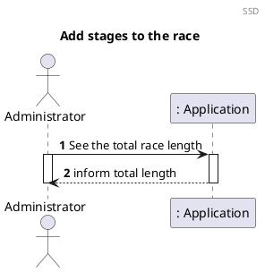
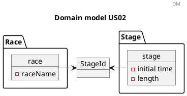
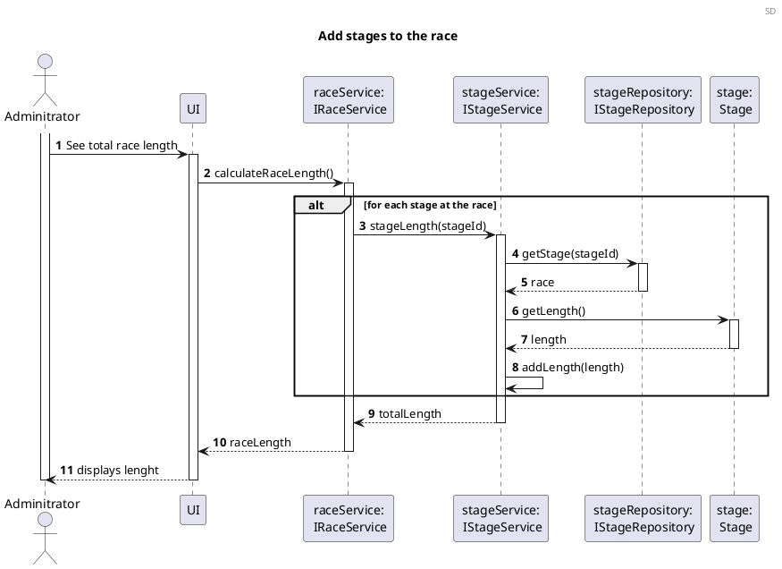

# US06 Race Length

# 1. Requirements

_Como Administrador, quero saber o comprimento total da prova, i.e., a soma do comprimento das etapas_

To know the total race length we just need to add the individual length of each stage.

## 1.1. System Sequence Diagram

The System Sequence Diagram below represents the interaction between the Administrator and the
Application.

## 1.2. Dependency of other user stories

This US depends on the US01, because we need to have a race to calculate the length, and on US02 so we can add the lengths.

# 2. Analysis

## 2.1 Race length entry

According to what was presented in the US, the total length of the race is calculated according to the somatory of the individual length of all the stages.

| Attributes | Rules                                                                  |
| ---------- | --------------------------------------------------------------         |
| length | required, numeric. The length of the race in meters. |

## 2.2 Domain Model Excerpt

For quick reference, there's a relevant extract of the domain model.

# 3. Design

## 3.1. Functionality Development

Regarding adding a stage to the race, the requirements specified
in [Analysis](#2-analysis) should be accommodated.

The System Diagram is the following:

## 3.2. Class Diagram

The Class Diagram is the following:

## 3.3. Applied Patterns

In order to achieve best practices in software development, to implement this US the following were
used:

- *Single Responsibility Principle* - Classes should have one responsibility, which means, only one
  reason to change;
- *Information Expert* - Assign a responsibility to the class that has the information needed to
  fulfill it;
- *Pure Fabrication* - CategoryService was implemented to manage all things related to add a
  Category.
- *Creator* - To create a category we need to check if the category name doesn't exist. 
- *Controller* - CreateStandardCategoryController was created;
- *Low Coupling* - Classes were assigned responsibilities so that coupling remains as low as
  possible, reducing the impact of any changes made to the objects later on;
- *High Cohesion* - Classes were assigned responsibilities so that cohesion remains high(they are
  strongly related and highly focused). This helps to keep the objects understandable and
  manageable, and also goes hand in hand with the low coupling principle.

## 3.4. Tests

### 3.4.1 Unit Tests

# 4. Implementation

# 5. Integration/Demonstration

# 6. Comments

