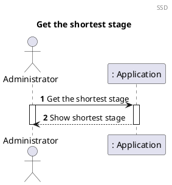
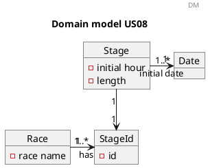
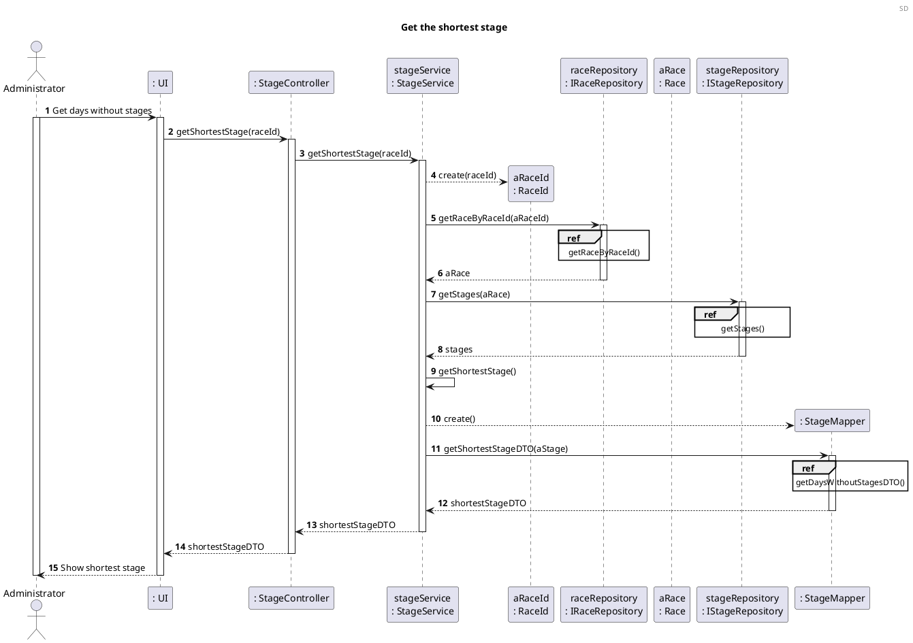
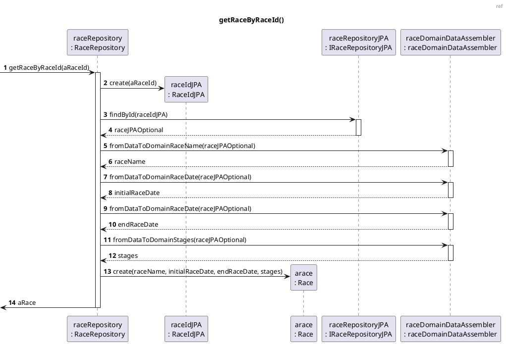

# US08 Get the shortest stage

# 1. Requirements

_As an administrator, I want to know the shortest step._

To know the shortest step in a race we first need to know the race, and after we will get the stages of the race and therefore 
obtain the stage with the smaller length.

## 1.1. System Sequence Diagram

The System Sequence Diagram below represents the interaction between an Administrator and the Application.



## 1.2. Dependency of other user stories

This US has dependencies on the [US01] and [US02], since it needs an existing Race and existing Stages within the Race.

# 2. Analysis

## 2.1 Race entry

According to what was presented in the US, a race is created upon request from the Administrator.

A race should be created with an alphanumeric string as its name, initial and end date. In addition, a Race will have its
own classification.

The identification of the race across the application is obtained by the combination  
of its name and its parent.

With that said, a race should have the following attributes:

| Value Objects          | Business Rules                                                         |
| -------------------    | --------------------------------------------------------------         |
| Name                   | required, alphanumeric, String                                         |
| Race Id                | numeric. The identification of the race                                |
| Initial date           | alphanumeric (String), with format "31/12/2021", required              |
| End date               | alphanumeric (String), with format "31/12/2021", required              |
| Stages                 | a list of the stages in the race                                       |
| Teams                  | a list of all the teams competing in the race                          |

## 2.2 Domain Model Excerpt

For quick reference, there's a relevant extract of the domain model.



# 3. Design

## 3.1. Functionality Development

The System Diagram is the following:





## 3.2. Class Diagram


## 3.3. Applied Patterns

In order to achieve best practices in software development, to implement this US the following were used:

- *Single Responsibility Principle* - Classes should have one responsibility, which means, only one reason to change;
- *Information Expert* - Assign a responsibility to the class that has the information needed to fulfill it;
- *Pure Fabrication* - CategoryService was implemented to manage all things related to add a Category.
- *Creator* - To create a category we need to check if the category name doesn't exist.
- *Controller* - CreateStandardCategoryController was created;
- *Low Coupling* - Classes were assigned responsibilities so that coupling remains as low as possible, reducing the
  impact of any changes made to the objects later on;
- *High Cohesion* - Classes were assigned responsibilities so that cohesion remains high(they are strongly related and
  highly focused). This helps to keep the objects understandable and manageable, and also goes hand in hand with the low
  coupling principle.

## 3.4. Tests

### 3.4.1 Unit Tests

Referring different aspects of the User Story, it is necessary to establish a set of unit tests in relation
to the domain classes and the Value Objects that make up the aggregate. The unit tests
are defined below, organized by the corresponding classes:

- **Unit Test 1:** 

```java
 
```

- **Unit Test 2:** 

```java

```

- **Unit Test 3:** 

```java

```

- **Unit Test 4:** 

```java

```

- **Unit Test 5:** 

```java

```

### 3.4.2 Integration Tests

In order to ensure that of all parts of the system and functionalities are working correctly (e.g. Controller, Service,
Repository, Model), it is necessary to define a set of Integration Tests that will simulate the system use cases, such
as:

- **Integration Test 1:** 

```java
 
```

- **Integration Test 2:** 

```java

```

- **Integration Test 3:** 

```java

```

- **Integration Test 4:** 

```java


```

- **Integration Test 5:** 

```java

```

# 4. Implementation

The main challenges that were found while implementing this functionality were:


To minimize these difficulties, a lot of research and study of reliable documentation was done.

So that we could present a reliable functionality, many tests were done, to identify as many possible errors in the
implementation as possible.

# 5. Integration/Demonstration


At the moment, no other user stories are dependent on this one, so its integration with other functionalities cannot be
tested further.

# 6. Comments
[us01]: US01_Create_Race.md

[us02]: US02.md

[us06]: US06.md

