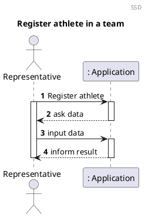
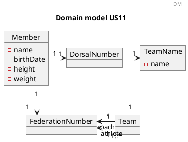
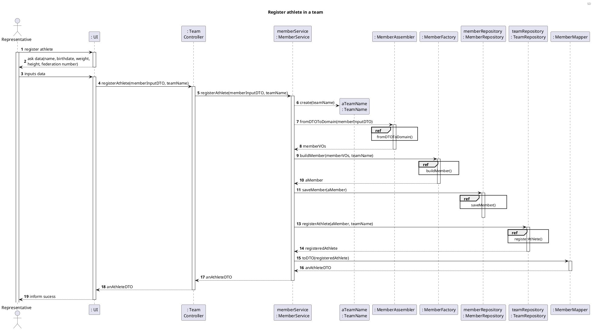
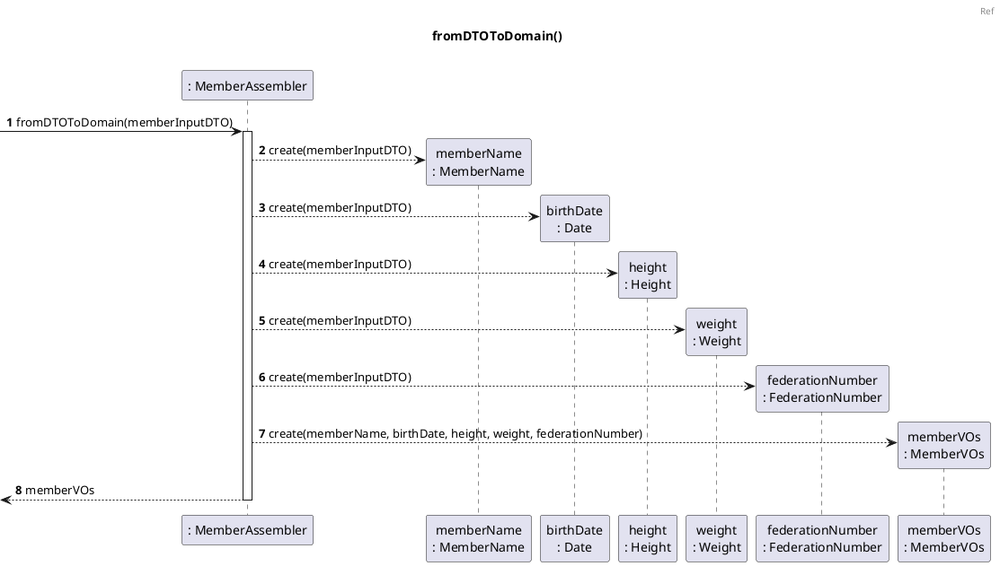
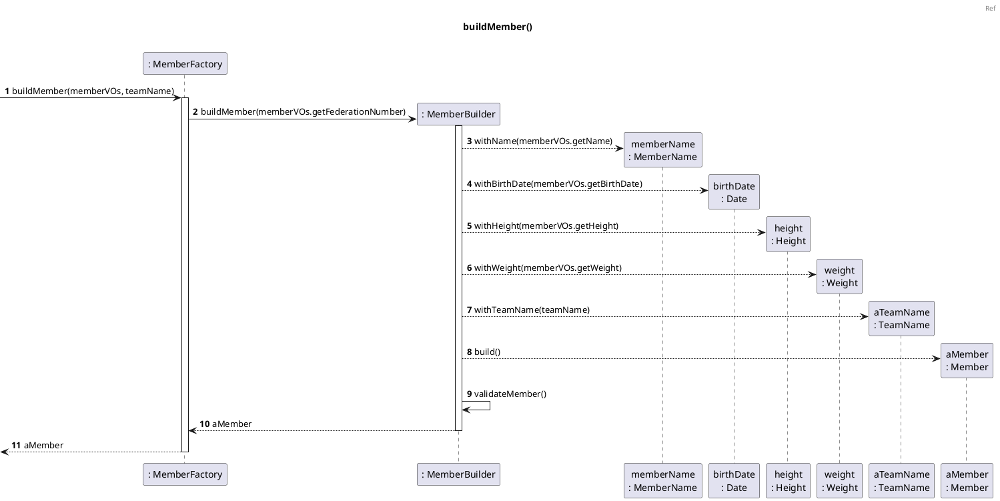
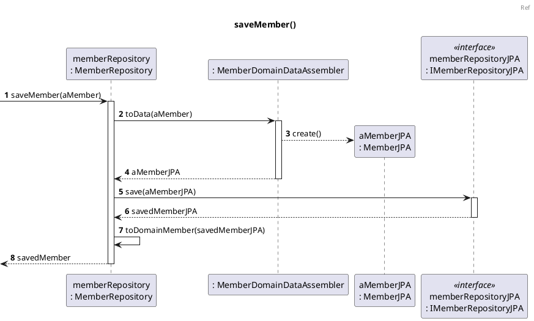
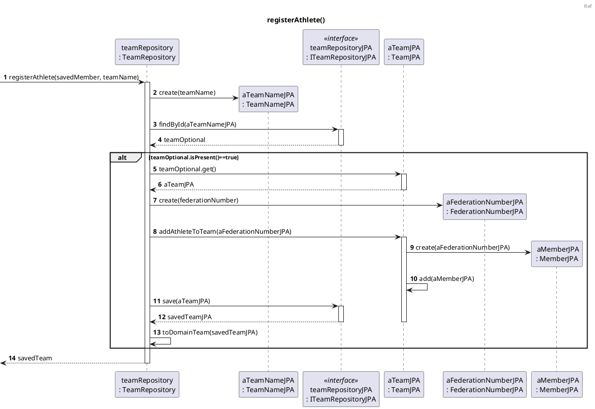

# US11 Register Athletes in a Team

# 1. Requirements

_As a representative, I want to register athletes in my team._

The representative with this functionality can add the athletes to it's team. To register the athletes in a team, the
data of the athlete is necessary.

## 1.1. System Sequence Diagram

The System Sequence Diagram below represents the interaction between a System Manager and the Application.



## 1.2. Dependency of other user stories

This US is dependent on the User Stories [US10], since it is necessary to have a team with a representative in order to
register the athletes in a given team.

## 1.3. Acceptance Criteria

# 2. Analysis

## 2.1 Business Rules

According to what was presented in the US, an Athlete is registered in a team upon request from the Representative of
the Team.

An Athlete should be created with certain data such as the name, the birthdate, the height, and it's weight. In
addition, the athlete is identified by its federation number within the application and a dorsal number is assigned to
the athlete when it is enrolled in the race.  
its own classification.

With that said, the athlete must have the following characteristics with these rules:

| Value Objects              | Business Rules                                                         |
| -------------------        | --------------------------------------------------------------         |
| Name                       | required, alphanumeric, String                                         |
| Federation Number          | required, unique, numeric, the identification of the athlete           |
| Birth Date                 | required, alphanumeric (String), with format "31/12/2021"              |
| Height                     | required, alphanumeric (String)                                        |
| Weight                     | required, alphanumeric (String)                                        |
| Dorsal Number              | unique, alphanumeric (String)                                          |

## 2.2 Domain Model Excerpt

For quick reference, there's a relevant extract of the domain model.



# 3. Design

## 3.1. Functionality Development

Regarding the registration of an athlete in a team, the requirements specified in [Analysis](#2-analysis) should be
accommodated.

The System Diagram is the following:











## 3.2. Class Diagram

The Class Diagram is the following:

## 3.3. Applied Patterns

In order to achieve best practices in software development, to implement this US the following were used:

- *Single Responsibility Principle* - Classes should have one responsibility, which means, only one reason to change;
- *Information Expert* - Assign a responsibility to the class that has the information needed to fulfill it;
- *Pure Fabrication* - CategoryService was implemented to manage all things related to add a Category.
- *Creator* - To create a category we need to check if the category name doesn't exist.
- *Controller* - CreateStandardCategoryController was created;
- *Low Coupling* - Classes were assigned responsibilities so that coupling remains as low as possible, reducing the
  impact of any changes made to the objects later on;
- *High Cohesion* - Classes were assigned responsibilities so that cohesion remains high(they are strongly related and
  highly focused). This helps to keep the objects understandable and manageable, and also goes hand in hand with the low
  coupling principle.

## 3.4. Tests

### 3.4.1 Unit Tests

Referring different aspects of the User Story, it is necessary to establish a set of unit tests in relation to the
domain classes, Value Objects and other classes that make up the aggregate. The unit tests are defined below:

- **Unit Test 1:** Assert the registration of a valid athlete.

```java
 @Test
    void registerAthleteSuccessfully(){
            //arrange


            //act


            //assert

            }
```

- **Unit Test 2:** Do not register an athlete in non-existing team.

```java
@Test
    void ensureAthleteIsNotRegisteredWhenTeamDoesNotExist(){
            //arrange

            //act

            //assert
            }
```

- **Unit Test 3:** Do not register an athlete in an invalid team.

```java
@Test
    void ensureAthleteIsNotRegisteredWhenTeamIsInvalid(){
            //arrange

            //act

            //assert
            }
```

- **Unit Test 4:** Do not register an athlete with an invalid Federation Number.

```java
@Test
    void ensureAthleteIsNotRegisteredWhenFederationNumberIsInvalid(){
            //arrange

            //act

            //assert
            }
```

- **Unit Test 5:** Do not register an athlete that is already registered.

```java
@Test
    void ensureAthleteIsNotRegisteredItIsAlreadyRegistered(){
            //arrange

            //act

            //assert

            }
```

- **Unit Test 6:** Do not register an athlete with an invalid Birthdate.

```java
@Test
    void ensureAthleteIsNotRegisteredWhenBirthDateIsInvalid(){
            //arrange

            //act

            //assert
            }
```

- **Unit Test 7:** Do not register an athlete with an invalid height.

```java
@Test
    void ensureAthleteIsNotRegisteredWhenHeightIsInvalid(){
            //arrange

            //act

            //assert
            }
```

- **Unit Test 8:** Do not register an athlete with an invalid weight.

```java
@Test
    void ensureAthleteIsNotRegisteredWhenWeightIsInvalid(){
            //arrange

            //act

            //assert
            }
```

- **Unit Test 9:** Do not register an athlete with an invalid name.

```java
@Test
    void ensureAthleteIsNotRegisteredWhenNameIsInvalid(){
            //arrange

            //act

            //assert
            }
```

### 3.4.2 Integration Tests

In order to ensure that of all parts of the system and functionalities are working correctly (e.g. Controller, Service,
Repository, Domain Model), it is necessary to define a set of Integration Tests that will simulate the system use cases,
such as:

- **Integration Test 1:** Assert the registration of a valid athlete.

```java
 @Test
    void registerAthleteSuccessfully(){
            //arrange

            //act

            //assert

            }
```

- **Integration Test 2:** Do not register an athlete in non-existing team.

```java
@Test
    void ensureAthleteIsNotRegisteredWhenTeamDoesNotExist(){
            //arrange

            //act

            //assert
            }
```

- **Integration Test 3:** Do not register an athlete in an invalid team.

```java
@Test
    void ensureAthleteIsNotRegisteredWhenTeamIsInvalid(){
            //arrange

            //act

            //assert
            }
```

- **Integration Test 4:** Do not register an athlete with an invalid Federation Number.

```java
@Test
    void ensureAthleteIsNotRegisteredWhenFederationNumberIsInvalid(){
            //arrange

            //act

            //assert
            }
```

- **Integration Test 5:** Do not register an athlete that is already registered.

```java
@Test
    void ensureAthleteIsNotRegisteredItIsAlreadyRegistered(){
            //arrange

            //act

            //assert

            }
```

- **Integration Test 6:** Do not register an athlete with an invalid Birthdate.

```java
@Test
    void ensureAthleteIsNotRegisteredWhenBirthDateIsInvalid(){
            //arrange

            //act

            //assert
            }
```

- **Integration Test 7:** Do not register an athlete with an invalid height.

```java
@Test
    void ensureAthleteIsNotRegisteredWhenHeightIsInvalid(){
            //arrange

            //act

            //assert
            }
```

- **Integration Test 8:** Do not register an athlete with an invalid weight.

```java
@Test
    void ensureAthleteIsNotRegisteredWhenWeightIsInvalid(){
            //arrange

            //act

            //assert
            }
```

- **Integration Test 9:** Do not register an athlete with an invalid name.

```java
@Test
    void ensureAthleteIsNotRegisteredWhenNameIsInvalid(){
            //arrange

            //act

            //assert
            }
```

# 4. Implementation

The main challenges that were found while implementing this functionality were:

To minimize these difficulties, a lot of research and study of reliable documentation was done.

So that we could present a reliable functionality, many tests were done, to identify as many possible errors in the
implementation as possible.

# 5. Integration/Demonstration

At the moment, no other user stories are dependent on this one, so its integration with other functionalities cannot be
tested further.

# 6. Comments

[us10]: US10


